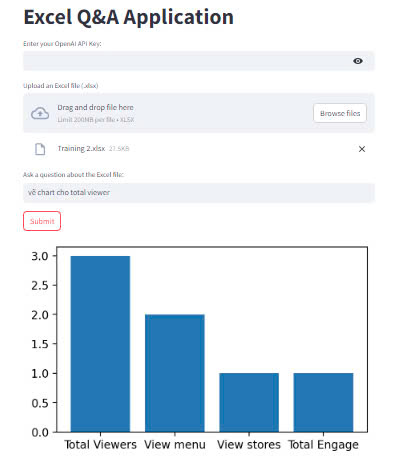

# RAG Chatbot Excel

## Overview

**RAG Chatbot Excel** is a chatbot system that allows users to ask questions and interact with data from an Excel file. The system processes user queries and provides answers based on the content of the Excel file. In addition, the chatbot can generate charts upon request to visually represent data insights.

## Features

- **Excel File Input**: Accepts an Excel file as input for data analysis.
- **User Queries**: Answers user questions based on the data from the provided Excel file.
- **Chart Generation**: Creates charts and graphs based on user requests.
- **Retrieval-Augmented Generation (RAG)**: Utilizes RAG to improve the quality and relevance of answers by incorporating the context of the data.

## Installation

1. Clone the repository:

   ```bash
   git clone https://github.com/yourusername/rag-chatbot-excel.git
   cd rag-chatbot-excel
   ```

2. Create a virtual environment and install dependencies:

   ```bash
   python -m venv venv
   source venv/bin/activate  # On Windows, use `venv\Scripts\activate`
   pip install -r requirements.txt
   ```

3. Set up the environment by configuring API keys and any necessary tokens for the chatbot to function.

4. Run the application:

   ```bash
   python main.py
   ```

## Usage

1. Upload your Excel file through the chatbot interface or specify a file path.
2. Ask the chatbot questions related to the data in the Excel file. For example:
   - "What is the total sales for Q1?"
   - "How many customers bought Product X?"
3. If needed, request a chart by asking the bot. For example:
   - "Can you show me a bar chart of sales per region?"
   - "Please create a pie chart for customer distribution."

The chatbot will process the query and either return the answer in text or generate the requested chart.

## Example

1. **Upload Excel File**:
   - You can upload a file named `sales_data.xlsx` via the chatbot or point it to a specific file path.

2. **Ask Questions**:
   - User: "What is the average sales price?"
   - Bot: "The average sales price is $120.50."

3. **Request Charts**:
   - User: "Show me a bar chart of sales by category."
   - Bot: [Bar chart is generated and displayed.]

## Technologies Used

- **Python**: Core programming language.
- **Pandas**: For reading and processing Excel files.
- **Matplotlib/Seaborn**: For generating visual charts.
- **RAG (Retrieval-Augmented Generation)**: For answering questions based on Excel data.

## Contributing

Feel free to fork this repository and submit pull requests for improvements, bug fixes, or new features.


